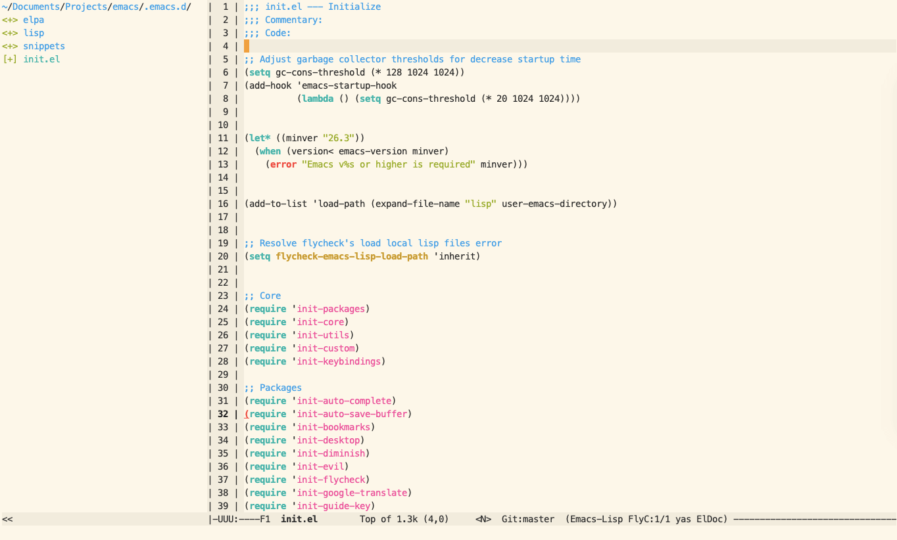

# emacs




## Contents

- [Bookmarks](#bookmarks)
- [Evil](#evil)


### Bookmarks

Set of keybindings for use build-in emacs bookmarks.
Bookmarks auto save into `.emacs.bookmarks` in the start emacs directory after close.
Save into start emacs directory needed to have opportunity work with different projects.
If start emacs directory contain saved before `.emacs.bookmarks` that he will load at start.

Keybindings:
```
[M-1] - List of bookmarks
[M-2] - Set bookmark
[M-3] - Delete bookmark
```


### Evil

Evil mode it is port of the vim's keybinding layer. Evil used in the all modes.
Some modes ignoring evil mode. For make possible to use evil mode in the certain
modes need to add this mode into evil init file to special section marked as `force evil`.
Search in the evil mode configurated by `evil-search` and `evil-visualstart`.

Keybindings:
```
default search:
[/] - search entered text
[n] - next result
[N] - previous result

visualstar search:
[M-8] - search selected text
[M-*] - reset highlighted result
[*] - next result
[#] - previous result
```
